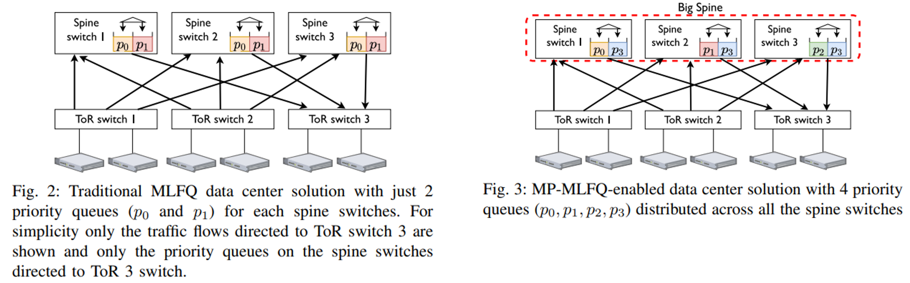

# MP-MLFQ: a practical flow scheduler for data center networks

The repository is intended for reproducibility of the evaluation artifacts described in the research paper:

:spiral_notepad: [A “Big-Spine” Abstraction: Flow Prioritization
With Spatial Diversity in The Data Center Network](https://iris.polito.it/handle/11583/2989653)  
Alessandro Cornacchia, Andrea Bianco, Paolo Giaccone, German Sviridov  
*IEEE HPSR Workshop on Data-Plane Programmability and Edge Network
Acceleration in the AI Era, 2024*


<div align="center">

</div>
<p></p>

Suggestions and extensions are welcome.

## :books: Project organization
The repository contains the following components:

- `markov_simulator.py`: this is the flow-level simulator used to evaluate MP-MLFQ performance and compare against MLFQ. It depends on several other components defined in the `include` folder.

- `threshold_solver.py`: this scripts implements the solvers used to derive the optimized demotion thresholds. 

- `plot.py`: script used to generate the graphs

- `launch/`: folder that contains some code to start batch of simulation runs, with different combination of parameters

- `ecdf/`: empirical flow sizes CDFs for both the Web Search and Data Mining workload

- `outputs/`: folder that contains the logs of every simulation run

- `sim_results/`: folder containing traces of every simulation scenario, from which to compute statistics such as the Flow Completion Times.

## :desktop_computer: Reproducing artifacts
### Pre-requisites
Install the `pip` dependencies listed in the file `pip_requirements`. 

### Re-run rimulations
We included our results in the folder `sim_results/`. If you only want to reproduce the paper's figures, then you can skip this step. 

From the main project directory:

```bash
python3 -m launch.launch --task 'two_queues_unequal_split_many_servers'
```

To customize simulation parameters, you can manually edit the file `launch/experiments.py`.

**NOTE**: to ease running the experiments, we already hard-coded the optimized demotion thresholds in the same file, and is not necessary to run the threshold optimizer.


### Plot results
To plot the results use `plot.py`. Edit the variable `category` using one of the following values:

* `''`: empty string would plot the average FCT, i.e., Fig.(a)-(b)
* `mice`: only flows within (0,100kB]
* `medium`: only flows within (100kB,10MB]
* `elpehant`: only flows within (10MB,)


## :rocket: Developers guidelines

### Simulator setup
To run custom simulations, please check the options supported by the simulator `markov_simulator.py -h`. 

### Demotion thresholds
To solve the optimization problem from scratch, you should use `threshold_solver.py`. The script supports several `task` and supports solution methods. Among them, exhaustive search for small problem instances, and `PSO` solver (Particle Swarm Optimization) for larger instances.

You can specify the `task` as command line option. For a list of supported tasks check `includes/solvers`. In the same folder there is also the code for some quick heuristics threshold assignments.  
As an example:
```
python3 .\threshold_solver.py --task PSOSolver --num_queues 2 --cdf 'ws_bp' --step 100 --lambda 0.7
```

solves using PSO for the MLFQ demotion thresholds. Instead:

```
python3 .\threshold_solver.py --task PSOSolverLBHybrid --num_queues 2 --cdf 'ws_bp' --lambda 0.5 --cdf_cut .85 --num_servers 4
```

solves for the MP-MLFQ.


## :man_scientist: Contributors

We are a team of researchers, should any issue should occur contact any of the paper's authors.

* [Alessandro Cornacchia,](https://www.polito.it/en/staff?p=alessandro.cornacchia) Postdoc Researcher at KAUST
* [Andrea Bianco](https://www.polito.it/personale?p=andrea.bianco), Full Professor at Politecnico di Torino
* [Paolo Giaccone](https://www.polito.it/personale?p=paolo.giaccone), Full Professor at Politencico di Torino
* [German Sviridov](https://www.linkedin.com/in/german-sviridov/?originalSubdomain=de), Research Engineer at Huawei Technologies
